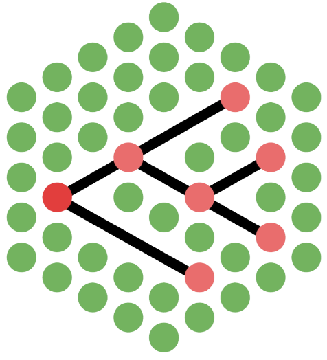

 <h1> Phylogeny Embedding  &    Approximate Representation </h1>
 

## Goldman Group - European Bioinformatics Institute 

PEAR can:
1. Compute the distance matrix given a set of phylogenetic trees;
2. Embed and represent the distance matrix in 2D or 3D.

See also the <a href="https://andrearubbi.github.io/Pear-EBI/index.html"> autogenerated documentation </a> and <a href="https://pypi.org/project/pear-ebi/"> PyPI </a>.

PEAR usage
==========
Pear is both a python software and library. It can be installed with `python -m pip install pear_ebi` or downloaded from <a href="https://github.com/AndreaRubbi/Pear-EBI">Github</a>. Pear is currently compatible with Linux and Mac OSs.

PEAR as a python library
------------------------
Once installed, Pear can be used to upload newick trees in python and represent them in embedded spaces. We recommend to use it on either jupyter notebook or lab, as these tools allow for more interaction with the graphs. On these platforms, the user is allowed to interact with widgets that allows to modify several parameteres of the plots. For specific uses and applications, see the <a href='https://github.com/AndreaRubbi/Pear-EBI/tree/pear_ebi/examples_tree_sets'>examples</a>.

PEAR as a program
-----------------
Run `pear_ebi --help` to see the complete list of arguments and flags.
### Simple usage

`pear_ebi examples_trees_sets/beast_trees/beast_run1.trees -m hashrf`

this script calculates the unweighted <a href='https://doi.org/10.1016/0025-5564(81)90043-2'>Robison Foulds</a> distances between the trees in the file "beast_run1.trees", which contains 1001 phylogenetic trees.

the flag *-m* indicates the method used to compute the dissimilarity between phylogeneic trees. In this case, [HasRF](https://code.google.com/archive/p/hashrf/) has been used.

To embed these distances in a lower-dimensional space, we can use PCoA (MDS) or tSNE:

`pear_ebi examples_trees_sets/beast_trees/beast_run1.trees -m hashrf -pca 2`

we therefore embedded the distance matrix in 2 dimensions. Using the flag *-quality* one can assess the correlation between the distances in the N-dimensional space and in the embedding; while *-report* computes more insightful metrics such as the trustworthiness and continuity of the embedding.

`pear_ebi examples_trees_sets/beast_trees/beast_run1.trees -m hashrf -pca 2 -plot --show`

The flags *-plot* and *--show* indicate that PEAR has to plot the embeddings and show them, respectively. *-plot* doesn't require any indication on the number of dimensions as it plots the embeddings in 2 dimensions if the distances are embedded in 2 dimensions, while it plots on 2 and 3 dimensions in any other case.

One can specify any number of files containing trees. Moreover, it is possible to specify a directory using *-dir*, and possibly a pattern using *-pattern*, in order to select multiple files.

`pear_ebi examples_trees_sets/beast_trees/beast_run1.trees -subset 100` shows the 3D and 2D embedding of a subset of 100 trees from the original collection.

#### Tree Set

It's possible to compute the distance matrix and re-use it in future runs of PEAR by specifying the distance matrix file with the flag *-d*. Additionally, it's possible to define the name of the output file (*-o*).

If any additional metadata is available, this may be specified by indicating a *.csv* file containing a dataframe of compatible shape.

### Config file
A standard config toml file can be used for specific emebddings of multiple sets of trees. Instances of toml files are reported in the <a href='https://github.com/AndreaRubbi/Pear-EBI/tree/pear_ebi/examples_tree_sets'>examples</a> folder.

Using the config file allows one to use all the features of PEAR, including additional embedding methods and plot designs. The config file can also be used to specify lists of indexes of interesting trees in the sets, in order to highlight them in the final plots.

### Interactive mode
`pear_ebi --i` :
this script launches the program in the interactive mode. Once the program starts, it is going to guide you through its usage thanks to an intuitive interface.

### Additional Dependencies
In order to get the complete report on the quality of embeddings, it may be necessary to run the following command to install additional dependencies:

`sudo apt-get install '^libxcb.*-dev' libx11-xcb-dev libglu1-mesa-dev libxrender-dev libxi-dev libxkbcommon-dev libxkbcommon-x11-dev`

It may be necessary to also install `libgcc` and remove old versions of `libstdc++` from the interpreter libraries.
________________________

## Licensing

This project is released under the terms of the MIT Open Source License. View
*LICENSE.txt* for more information.
